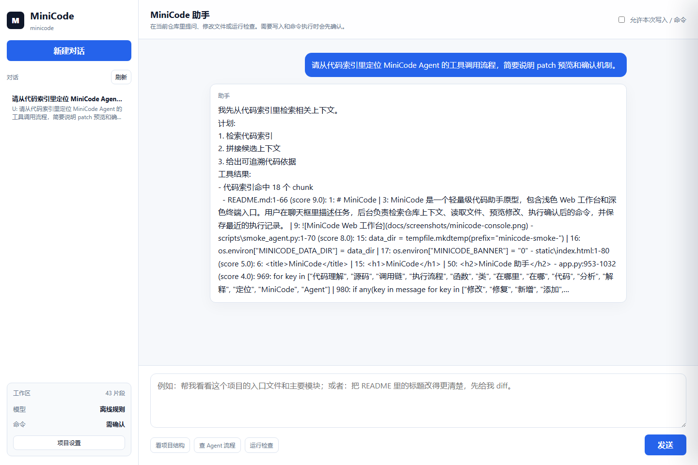
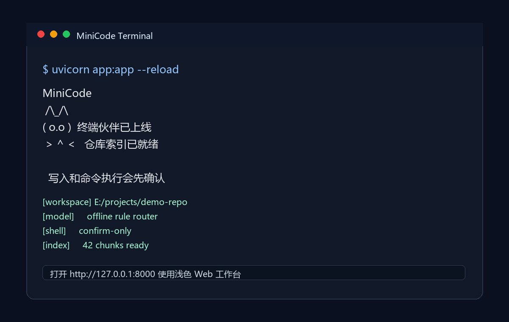

# MiniCode

MiniCode 是一个轻量级代码助手原型，包含浅色 Web 工作台和深色终端入口。用户在聊天框里描述任务，后台负责检索仓库上下文、读取文件、预览修改、执行确认后的命令，并保存最近的执行记录。

## 界面预览

Web 工作台：



终端入口：



## 功能

- 仓库感知：启动后索引当前工作区，支持按文件和代码片段检索上下文。
- 聊天驱动：用户描述任务，后台自动选择搜索、读取、检索、修改预览或命令执行工具。
- 修改前预览：文件修改默认先生成 diff，确认后再写入。
- 风险确认：写文件、删除文件和执行命令需要显式确认。
- 执行记录：项目设置里可以查看文件地图、最近工具调用和后台输出。
- 离线可用：没有模型 Key 时也能用规则路由完成基础仓库分析。

## 快速启动

```bash
cd minicode
python -m venv .venv
.venv\Scripts\activate
pip install -r requirements.txt
uvicorn app:app --reload
```

打开 `http://127.0.0.1:8000`。

## 环境变量

| 变量 | 说明 | 默认值 |
| --- | --- | --- |
| `MINICODE_WORKSPACE` | 要分析的仓库目录 | 当前项目 |
| `MINICODE_DATA_DIR` | SQLite 数据目录 | `data/` |
| `OPENAI_API_KEY` | 可选，开启模型规划 | 空 |
| `OPENAI_BASE_URL` | 可选，OpenAI-compatible endpoint | 空 |
| `MINICODE_MODEL` | 模型名称 | `gpt-4.1-mini` |
| `MINICODE_ALLOW_SHELL` | 是否默认允许 shell | `0` |
| `MINICODE_BANNER` | 是否打印终端启动页 | `1` |

## API

- `GET /api/bootstrap`：获取工作区、会话和索引状态。
- `GET /api/repo-map`：查看索引文件地图。
- `GET /api/rag?q=...`：检索代码上下文。
- `POST /api/chat`：聊天入口。
- `POST /api/tool`：工具调用入口。
- `POST /api/patch/preview`：生成修改预览。
- `POST /api/patch/apply`：确认后应用修改。
- `POST /api/index/rebuild`：重建代码索引。

## 验证

```bash
python -m py_compile app.py
python scripts/smoke_agent.py
```

Smoke test 会覆盖健康检查、索引重建、代码检索、修改预览、命令确认拦截和确认执行。
